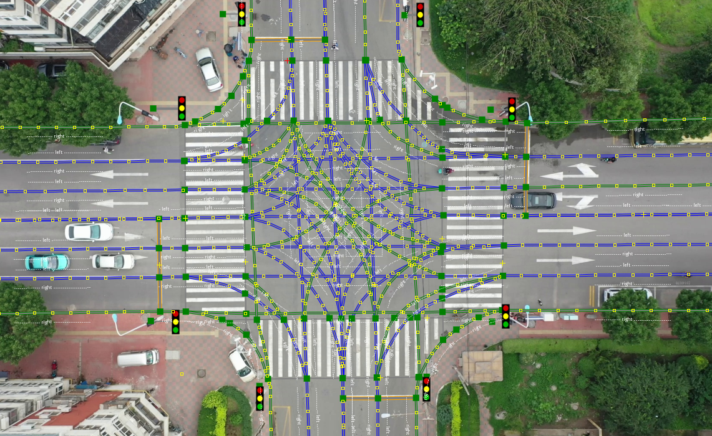

# Format of the SIND dataset

  

  

                                              Fig.1 Ground Coordinate System and Traffic Lights Distribution 

1. <kbd>Veh_smoothed_tracks.csv</kbd>  
This file records the time-dependent vehicle trajectory and motion state parameters:

|Column|  track_id   | frame_id  |   timestamp_ms | agent_type|x|y|vx|vy|yaw_rad|heading_rad|length|width|ax|ay|v_lon|v_lat|a_lon|a_lat|
| ---- |  ----  | ----  | ----  | ---- |---- |---- |----|---- |---- |---- |---- |---- |---- |---- |---- |---- |---- |---- |
|Unit| [-] |[-] | [ms]|[-]|[m]|[m]|[m/s]|[m/s]|[rad]|[rad]|[m]|[m]|[m/s^2]|[m/s^2]|[m/s]|[m/s]|[m/s^2]|[m/s^2]|

- track_id: the id number of the vehicle in this record	
- frame_id:	the id number of the data frame in this record
- timestamp_ms:	The time corresponding to each data frame
- agent_type: the specific class to which the vehicle belongs(car, truck, bus, motorcycle, bicycle, tricycle)	
- x	: The x position of the center of the vehicle bounding box in the ground coordinate system
- y	: The y position of the center of the vehicle bounding box in the ground coordinate system
- vx: The component of the center's velocity in the x-direction	
- vy: The component of the center's velocity in the y-direction	
- yaw_rad : the angle between the direction of the front longitudinal axis of the vehicle and the positive direction of the x-axis	
- heading_rad: the angle between the moving direction of the center of the vehicle bounding box and the positive x-axis	
- length: the length of the vehicle	
- width: the width of the vehicle	
- ax: The component of the acceleration at the center in the x direction	
- ay: The component of the acceleration at the center in the y direction	
- v_lon: Component of the center velocity in the direction of the vehicle's longitudinal axis
- v_lat: Component of the center velocity in the direction of the vehicle's lateral axis
- a_lon:Component of the center acceleration in the direction of the vehicle's longitudinal axis
- a_lat:Component of the center acceleration in the lateral direction of the vehicle

2. <kbd>Ped_smoothed_tracks.csv</kbd>  
Similar format to <kbd>Veh_smoothed_tracks.csv</kbd>, but pedestrians are treated as points without scale and orientation:  

|Column|  track_id   | frame_id  |   timestamp_ms | agent_type|x|y|vx|vy|ax|ay|
| ---- |  ----  | ----  | ----  | ---- |---- |---- |----|---- |---- |---- |
|Unit| [-] |[-] | [ms]|[-]|[m]|[m]|[m/s]|[m/s]|[m/s^2]|[m/s^2]|  

- track_id:the id number of the pedestrain in this record		P1,P2,...,Pn
- agent_type: Only `pedestrian`	  
- Other items have the same meaning as the items with the same name in the <kbd>Veh_smoothed_tracks.csv</kbd> file.

3. <kbd>Veh_tracks_meta.csv</kbd>   
This file provides the metadata of vehicle track, mainly including vehicle attributes and track labels. 

|Column| trackId | initialFrame | finalFrame |Frame_nums|length|width|class|CrossType|Signal_Violation_Behavior|
| ---- |  ----  | ----  | ----  | ---- |---- |---- |----|---- |----|
|Unit| [-] |[-] | [-]|[-]|[m]|[m]|[-]|[-]|[-]|  

- trackId: 	the id number of the vehicle in this record	
- initialFrame:	The first data frame ID that the vehicle begins to appear in the record
- finalFrame:	The last data frame ID of the vehicle in the record
- Frame_nums: The total number of data frames of vehicle track, which is equal to finalframe - initialframe + 1
- length: the length of the vehicle	
- width: the width of the vehicle 		
- class: One of `cars, trucks, buses, motorcycles, bicycles and tricycles`  	
- CrossType: The class of vehicles passing through the intersection, which are classified as `StraightCross`, `LeftTurn`, `RightTurn`, and `Others`( not necessarily passing through the intersection, maybe some special action such as driving to the sidewalk)	
- Signal_Violation_Behavior: The three labels are `red-light running`, `yellow-light running`, `No violation of traffic lights`, the first two are only for vehicles with left turn and straight ahead behavior. (In China, right turning vehicles are allowed to run red lights)
 
4. <kbd>Ped_tracks_meta.csv</kbd>  
The behavior of pedestrians is not easy to describe, so we do not provide labels for their behavior type and violation type.
  
|Column| trackId | initialFrame | finalFrame |Frame_nums|  
| ---- |  ----  | ----  | ----  | ---- |  
|Unit| [-] |[-] | [-]|[-]|

- trackId: the id number of the pedestrain in this record		P1,P2,...,Pn	
- class: Only `pedestrain`  
Other items have the same meaning as the items with the same name in the <kbd>Veh_tracks_meta.csv</kbd> file

5. <kbd>TrafficLight_[record_name].csv</kbd>  
This document records the states of traffic lights over time:

|Column|RawFrameID| timestamp(ms) | Traffic light X|  
| ---- |  ----  | ----  | ----  |   
|Unit| [-] |[ms] | [0,1,3]|  
- FrameID: The original frame Id corresponding to the moment when the state of the traffic light changes(The raw frame corresponding to the data frame: `Frame * 3 = RawFrameID`) 
- timestamp（ms）:	The moment when the state of the traffic light changes 
- Traffic light X(1-8): 0 for red light status, 1 for green light status, 3 for yellow light status; the traffic light position is as shown in the Fig.1.

6. <kbd>Recording_metas.csv</kbd>  
This file records some information related to data collection.  
<table>
  <tr>
    <td>Column</td>
    <td>RecordingID</td>
    <td>City</td>
    <td>Record weekday</td>
    <td>Record time period</td>
    <td>Weather</td>
    <td>Raw frame rate</td>
    <td>Record duration</td>
    <td>Tps_num</td>
    <td>number of categories</td>
  </tr>
  <tr>
    <td>Unit</td>
    <td>[-]</td>
    <td>[-]</td>
    <td>[-]</td>
    <td>[-]</td>
    <td>[-]</td>
    <td>[Hz]</td>
    <td>[s]</td>
    <td>[-]</td>
    <td>[-]</td>
  </tr>
</table>  

- RecordingID: the record's number among all records	
- City: The city where the data is located. Only `Tianjin` is in all records of  SIND.	
- Record weekday: The weekday on which the data was collected.	
- Record time period: This record corresponds to a specific time period, accurate to the hour.	
- Weather:Sunny, cloudy, or after rain.	
- Raw frame rate: Fixed at 29.97hz
- Record duration:Total duration of the record(Unit: second). 	
- Tps_num: Total number of traffic participants in this record 	
- number of categories(car, truck, bus, bicycle, motorcycle, tricycle, pedestrian):The number of traffic participants in each category in this record
***
In addition to the record file, we also provide a [high-definition map](Data/mapfile-Tianjin.osm#sdd) of the intersection in [Lanelet2](https://github.com/fzi-forschungszentrum-informatik/Lanelet2) format\(see Fig.2\), the origin of the map coincides with the origin of the ground coordinate system.  

  

  

                                                    Fig.2 Semantic HD-map in lanelet2 format
