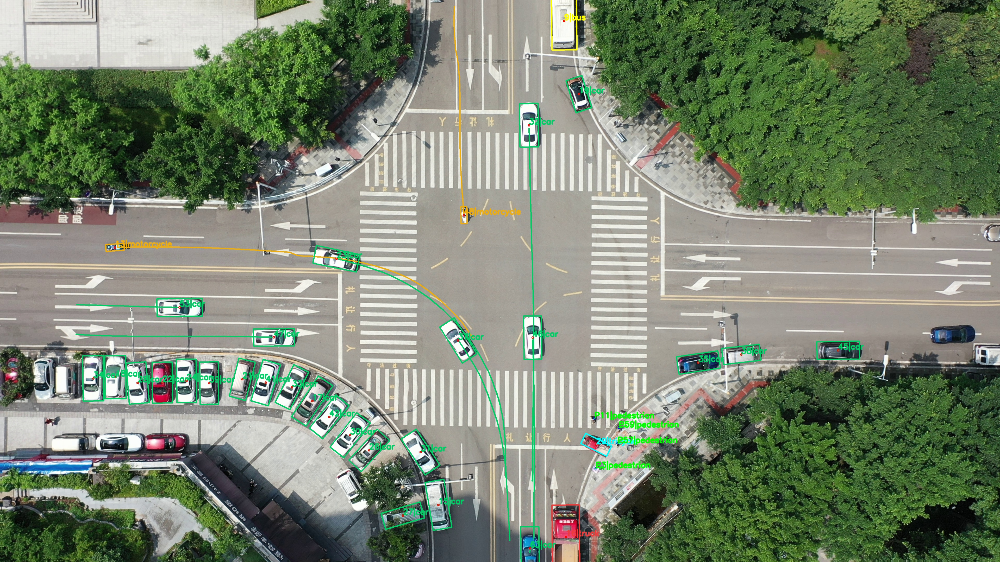
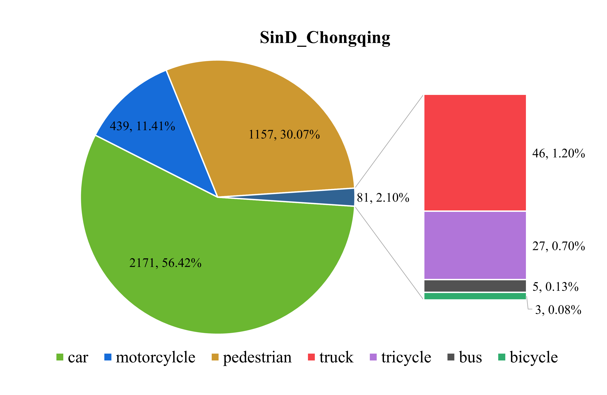
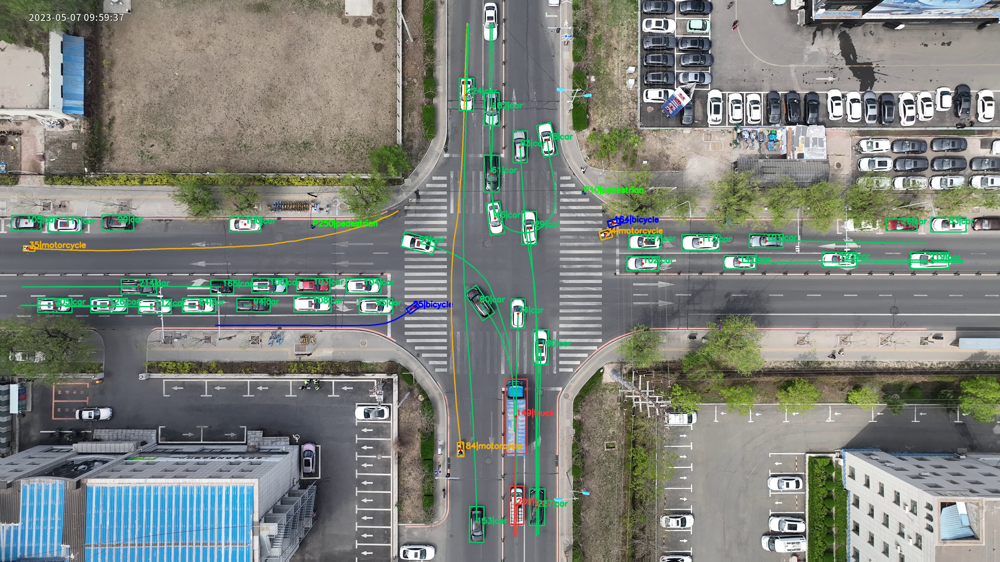
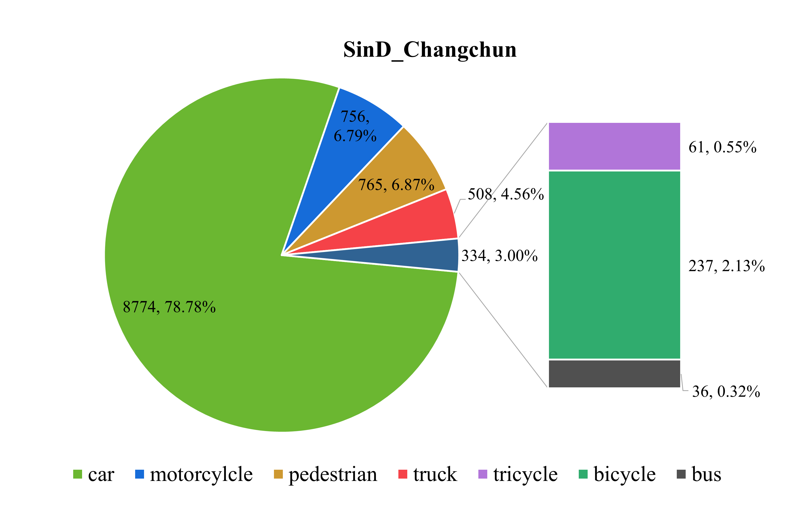

# SIND
## Introduction
A key challenging scenario for autonomous driving is intersections, but there are currently no large-scale public trajectory datasets on signalized intersections. Motivated by this,  we constructed the SIND dataset, which is based on 4K videos captured by drones and provides information including traffic participant trajectories, traffic light status, and high-definition maps. As of now, we have collected 15 intersections from multiple cities, of which four have been released, located in Tianjin, Chongqing, Changchun, and Xi'an in China.  A demo video of the dataset can be viewed on [Youtube](https://youtu.be/H9QSGqioYww) or [BiliBili](https://www.bilibili.com/video/BV1wN4y1F7Sc?share_source=copy_web&vd_source=07ce0c26f3e74d7ba5041a25df0072be).  The corresponding [paper](https://arxiv.org/abs/2209.02297) has been accepted by 2022 IEEE Conference on Intelligent Transportation Systems (ITSC 2022).

## Data Subset
### SIND_Tianjin
<div align=center>

</div>   
SIND_Tianjin contains 7 hours of recording including over 13,000 traffic participants with 7 types,  HD maps and traffic light information are used to count traffic light violations by vehicles in them.  Clearly, SIND_Tianjin has a high proportion of vulnerable road users and frequent non-motor vehicle violations.  
<div align=center>
  
</div>  

### SIND_Chongqing
<div align=center>
  
</div>     
Sind_Chongqing was collected at an intersection in Chongqing, where the traffic density was low and the freedom of traffic participants was high; Compared to the situation where pedestrians and vehicles share traffic lights in Sind_Tianjin, Sind_Chongqing have independent vehicle traffic lights and pedestrian traffic lights. However, for vehicles, the conflict between turning left and going straight is still normal.

### SIND_Changchun
<div align=center>
  
</div>   
SinD_Changchun is an intersection located on a traffic artery with a high traffic density in Changchun. In this dataset, dense unprotected left turn conflicts can be observed, and even conflicting traffic congestion occurs when a green wave of traffic cannot completely pass through the intersection.

### SIND_Xi'an
<div align=center>
  
</div>   
SinD_Xi'an was collected at an intersection with moderate traffic density in Xi'an City, mainly consisting of vehicles; Similar to SinD-Tianjin, it has a shared traffic signal for pedestrians and vehicles, and there are conflicts between left turns and straight traffic.

##  Access
You can get the project and a sample record by executing `git clone https://github.com/SOTIF-AVLab/SinD.git`. To access the full dataset， please contact us by e-mail:
hong_wang@tsinghua.edu.cn or 13645450063@163.com or 18975505069@163.com     
* The title of the email should be: __\[Apply for SinD\] name\_country(region)\_organization__    
**Please note that our dataset requires the use of an educational email for application**, and please describe your laboratory or department, research interest, and the purpose of the dataset in detail in the email content; After confirmation, we will send the complete data link as soon as possible(By default, a reply email containing a link will be sent to email address which you contact us). You are also welcome to further communicate with us

## Description of Format

Currently, SinD consists of 4 cities with several records, each record contains 8-22 minutes of trajectories of traffic participants. In addition to the trajectories and motion state parameters of traffic participants, SIND also provides synchronized traffic light states and lanelet2 map. Each record contains the following <kbd>.csv</kbd> files:
For detailed format see [Format.md](Format.md#sdd)  

## Visualization  
For visualization see [SIND-Vis-tool](https://github.com/SOTIF-AVLab/SinD/tree/main/SIND-Vis-tool)  

## Applications based on this dataset
The dataset provides a simple traffic light violation label for vehicles. In addition, our team has developed a [method](https://github.com/SOTIF-AVLab/DOTL) to monitor more violations of vehicles  


 
## Citation  
If you use SinD or its code in your work, please cite our datasets as follows:
```
@INPROCEEDINGS{9921959,  author={Xu, Yanchao and Shao, Wenbo and Li, Jun and Yang, Kai and Wang, Weida and Huang, Hua and Lv, Chen and Wang, Hong},  
booktitle={2022 IEEE 25th International Conference on Intelligent Transportation Systems (ITSC)},   
title={SIND: A Drone Dataset at Signalized Intersection in China},  
year={2022},  volume={},  number={},  pages={2471-2478},  
doi={10.1109/ITSC55140.2022.9921959}}
```  
## Acknowledgements

Our visualization code is built upon the public code of the following papers:
* [ The ind dataset: A drone dataset of naturalistic road user trajectories at german intersections, IV'2020](https://github.com/ika-rwth-aachen/drone-dataset-tools)
* [Constructing a Highly Interactive Vehicle Motion Dataset, IROS'2019](https://github.com/interaction-dataset/interaction-dataset)  


## Organization


- School of Vehicle and Mobility, Tsinghua University
- Tsinghua Intelligent Vehicle Design and Safety Research Institute
- Safety Of The Intended Functionality（SOTIF） Research Team

## Update log

- 2022.9.6: Fixed some minor errors. 1.Fixed category: pedestrian 2. Added missing part of traffic light information of 8\_5\_1 
- 2022.9.9: Add paper links and citation requirements in the page
- 2022.10.14: Added item: Application based on this dataset
- 2024.1.1: Update the map file: Fixed errors and used arcs to connect lanes
- 2024.6.23: Major update, updated introduction, sample data, and schematic diagram of three newly collected intersections
