# 🚦 SinD Dataset (Signalized Intersection Drone Dataset)

[](LICENSE)
[](LICENSE_CODE)
[](https://github.com/SOTIF-AVLab/SinD/releases)
[](https://www.python.org/)

Welcome to the official repository of the **SinD Dataset**, a drone-based
trajectory dataset for heterogeneous traffic at signalized intersections in
China.

🔥 **SinD v2.0 is now available.** The new release features cross-domain
intersection diversity, high-interaction traffic, semantic scenario
annotations, a compact policy-testing toolchain, and a 3DGS visual simulation
extension.

[Paper](https://arxiv.org/abs/2607.16943) · [YouTube Demo](https://youtu.be/H9QSGqioYww) · [Bilibili Demo](https://www.bilibili.com/video/BV1wN4y1F7Sc)

---

## 📑 Table of Contents

- [SinD v2.0 (Latest)](#-sind-v20-latest)
  - [What's New in v2.0?](#whats-new-in-v20)
- [Data Subset](#data-subset)
  - [SIND Tianjin](#sind_tianjin)
  - [SIND Chongqing](#sind_chongqing)
  - [SIND Changchun](#sind_changchun)
  - [SIND Xi'an](#sind_xian)
- [SinD 2.0 Dataset Feature Analysis](#sind-20-dataset-feature-analysis)
- [Semantic Scenario Examples](#semantic-scenario-examples)
  - [High-risk MprTTC interactions](#high-risk-mprttc-interactions)
  - [Visual shielding](#visual-shielding)
  - [Narrow feasible area](#narrow-feasible-area)
  - [Rule-violation cases](#rule-violation-cases)
  - [Scenario Testing Toolchain](#scenario-testing-toolchain)
  - [3DGS Visual Simulation Extension](#3dgs-visual-simulation-extension)
  - [SinD v2.0 Resources](#sind-v20-resources)
- [SinD v1.0](#-sind-v10)
- [Quick Installation](#-quick-installation)
- [Dataset Access](#-dataset-access)
- [Citation](#-citation)
- [Acknowledgements](#-acknowledgements)

---

## 🚀 SinD v2.0 (Latest)

### What's New in v2.0?

- **Cross-domain diversity:** trajectories from **six signalized intersections**
  across four cities: Changchun, Tianjin, Xi'an, and Chongqing.
- **High-interaction traffic:** heterogeneous participants, dense multi-agent
  negotiation, and location-dependent kinematic regimes.
- **Semantic scenario annotations:** SOTIF-oriented labels for high-risk
  interaction, visual shielding, narrow feasible areas, and rule-related events.
- **Testing toolchain:** reproducible scene replay and policy testing with
  ground truth, RiskIDM, and Diffusion baselines, with the integration of [trajdata](https://github.com/NVlabs/trajdata).
- **3DGS extension (will be released soon):** reconstructed intersections and ego-view simulation for
  camera-based and vision-based autonomous-driving research.


## Data Subset

### SIND_Tianjin

<div align=center>

</div>

SIND_Tianjin contains 7 hours of recording including over 13,000 traffic participants with 7 types, HD maps and traffic light information are used to count traffic light violations by vehicles in them. Clearly, SIND_Tianjin has a high proportion of vulnerable road users and frequent non-motor vehicle violations.

<div align=center>

</div>

### SIND_Chongqing

<div align=center>
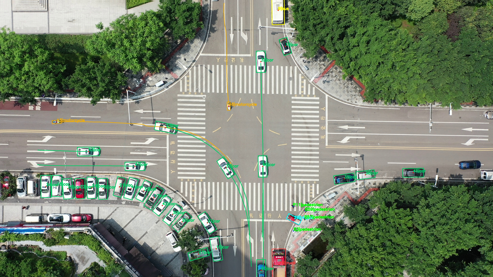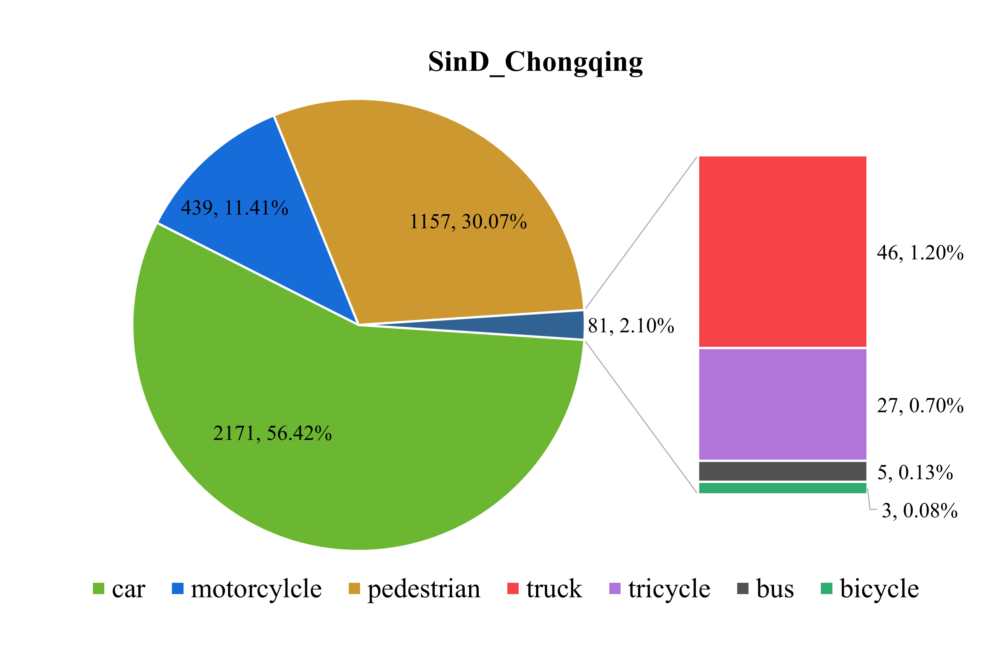
</div>

Sind_Chongqing was collected at an intersection in Chongqing, where the traffic density was low and the freedom of traffic participants was high; Compared to the situation where pedestrians and vehicles share traffic lights in Sind_Tianjin, Sind_Chongqing have independent vehicle traffic lights and pedestrian traffic lights. However, for vehicles, the conflict between turning left and going straight is still normal.

### SIND_Changchun

<div align=center>
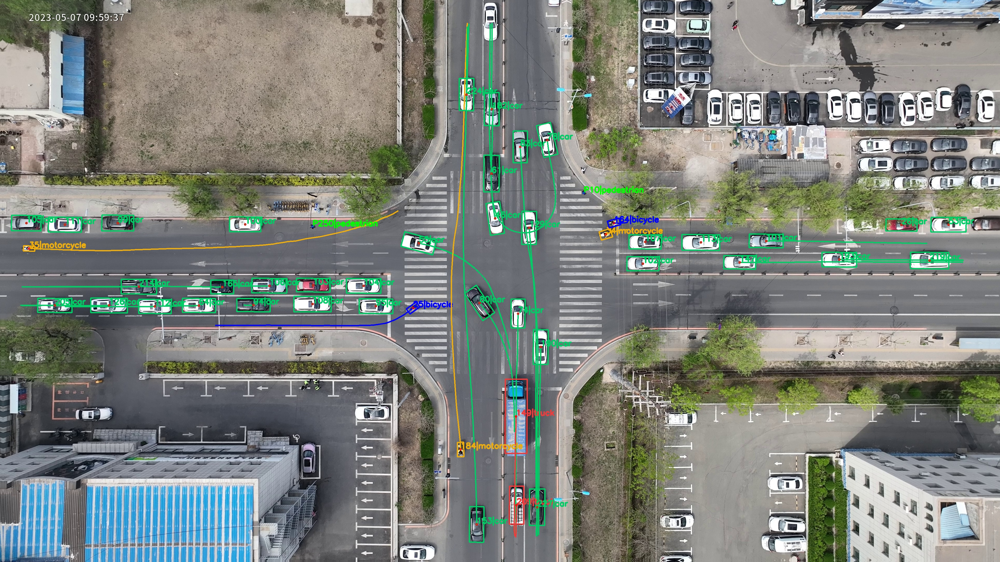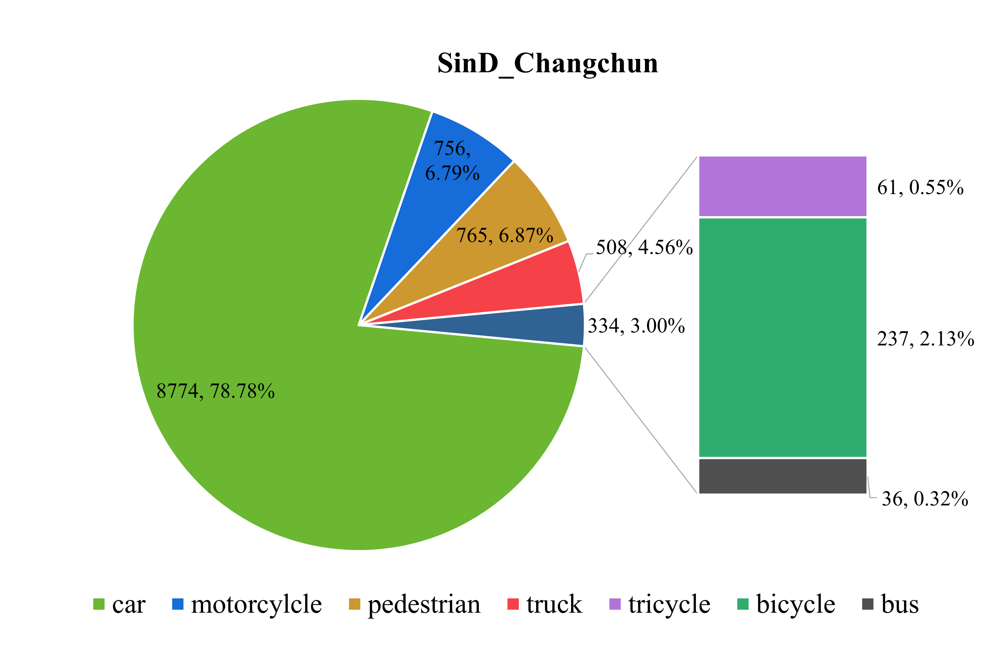
</div>

SinD_Changchun is an intersection located on a traffic artery with a high traffic density in Changchun. In this dataset, dense unprotected left turn conflicts can be observed, and even conflicting traffic congestion occurs when a green wave of traffic cannot completely pass through the intersection.

### SIND_Xi'an

<div align=center>

</div>

SinD_Xi'an was collected at an intersection with moderate traffic density in Xi'an City, mainly consisting of vehicles; Similar to SinD-Tianjin, it has a shared traffic signal for pedestrians and vehicles, and there are conflicts between left turns and straight traffic.

## SinD 2.0 Dataset Feature Analysis

SinD 2.0 provides precomputed cross-intersection analysis examples for scenario understanding and benchmark design. The interaction-degree summary measures whether each interaction component contains two, three, or four-plus traffic participants, exposing how often scenes require multi-agent reasoning rather than pairwise conflict handling.

<div align=center>
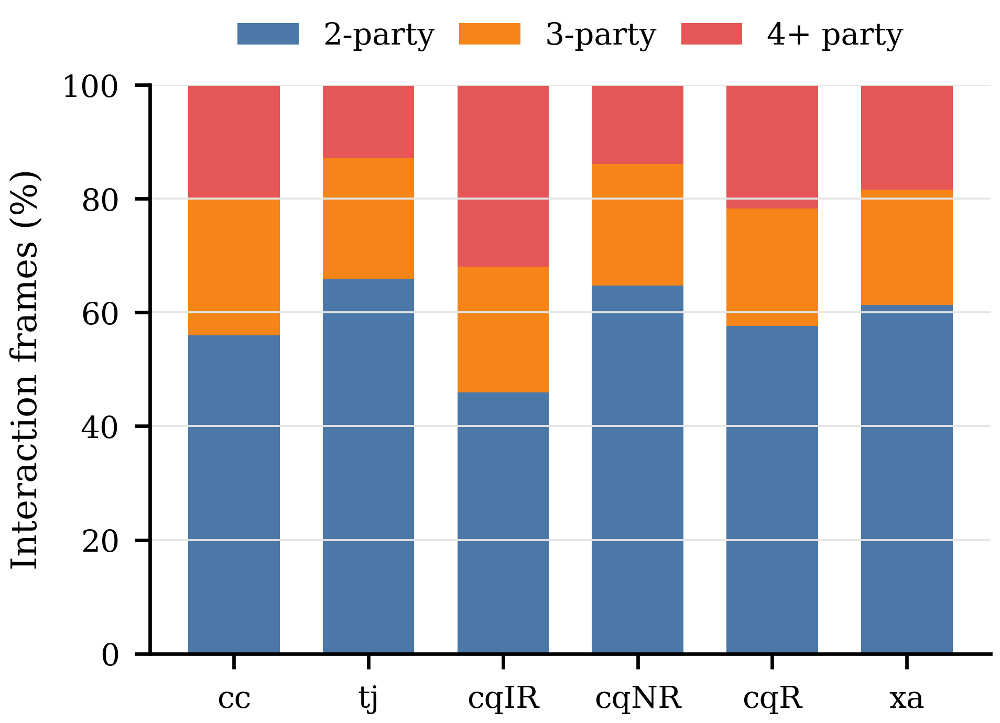
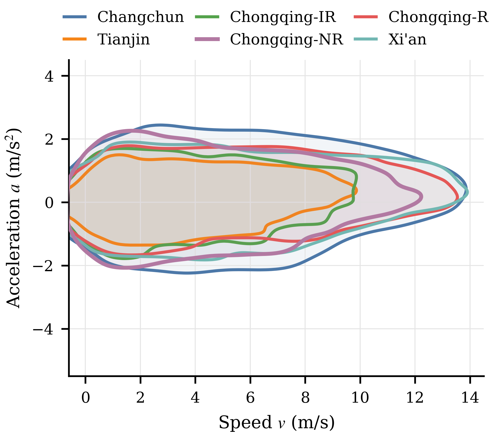
</div>

The kinematic envelope compares the 95% speed-acceleration operating regions across the six released SinD 2.0 intersections. It highlights location-dependent driving styles and corner-case motion regimes that are useful for domain-shift analysis, policy stress testing, and scenario mining.

<div align=center>

</div>

The conflict-mode chord diagram summarizes how maneuver pairs contribute to interaction episodes across city groups. It provides a compact view of site-specific conflict structure, such as left-turn versus straight-through interactions and vulnerable-road-user conflicts.

<div align=center>
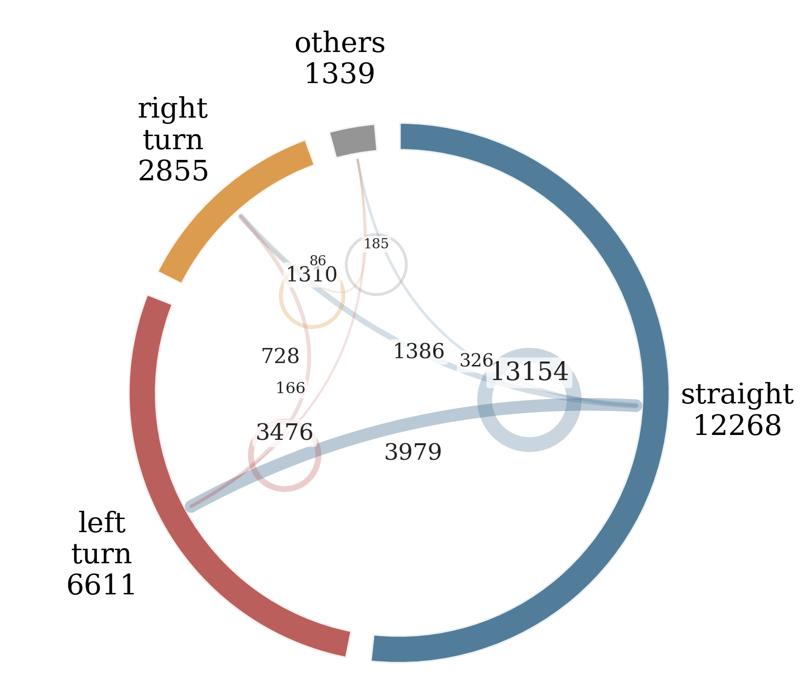
</div>

## Semantic Scenario Examples

SinD 2.0 also includes semantic scenario labels for structured high-value cases. The public schema supports a shared time window and ego agent, plus type-specific fields such as challenger, shielding, shielded, risk score, feasible-area, and violation metadata.

The semantic labeling framework uses a shared scenario schema for common metadata and extends it with event-specific fields for non-compliance, high-risk interaction, visual shielding, and narrow feasible-area triggers.

<div align=center>
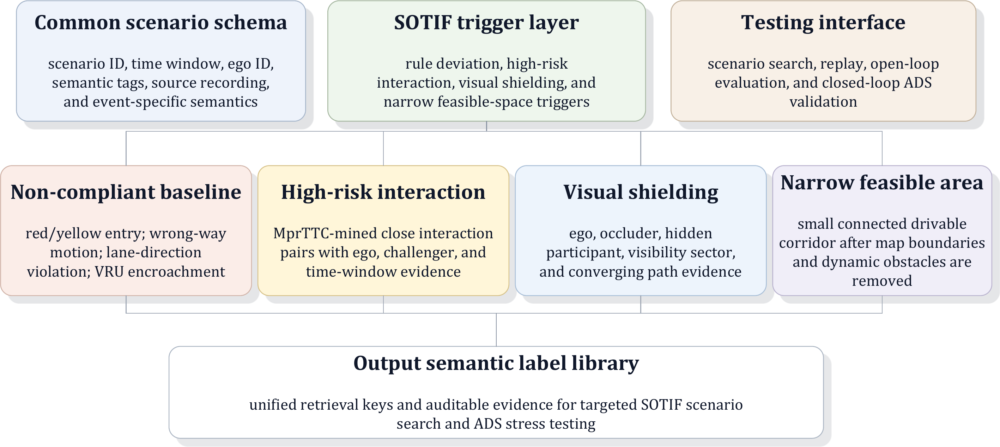
</div>

### High-risk MprTTC interactions

These cases mark short-horizon interaction risks between an ego participant and a primary conflicting participant, while preserving surrounding traffic context for policy evaluation.

<div align=center>
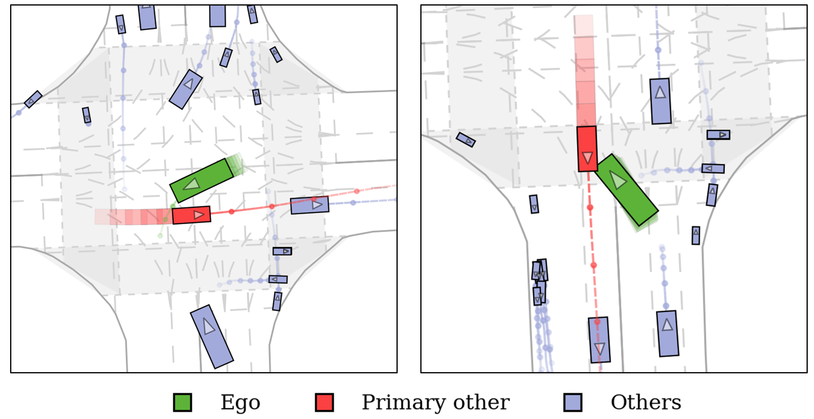
</div>

### Visual shielding

Visual-shielding cases describe occlusion relationships among ego, occluding participant, and hidden target, capturing situations where conflict risk is revealed only after partial emergence.

<div align=center>
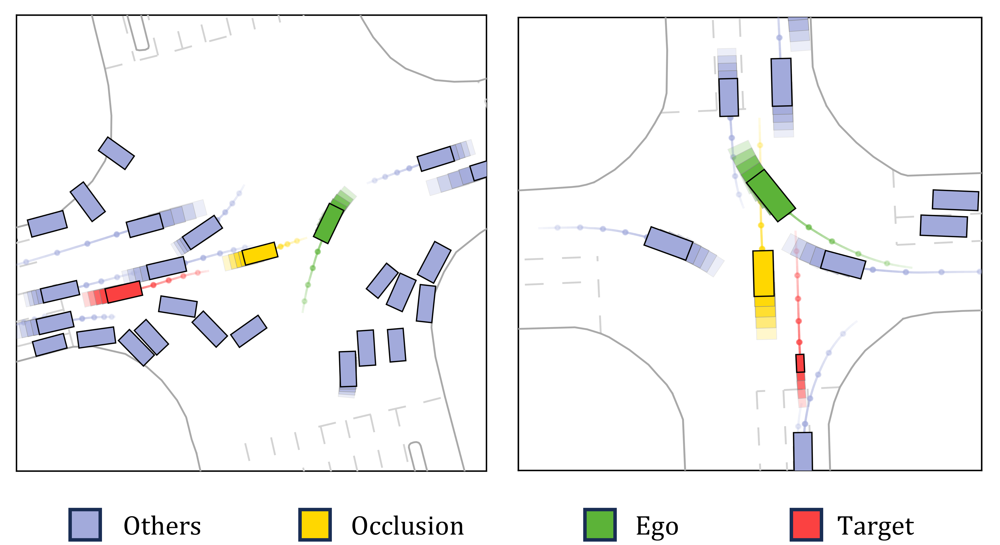
</div>

### Narrow feasible area

Narrow feasible-area cases identify scenes where surrounding participants constrain the ego's reachable space, exposing dense traffic negotiation and blocked front-grid regions.

<div align=center>
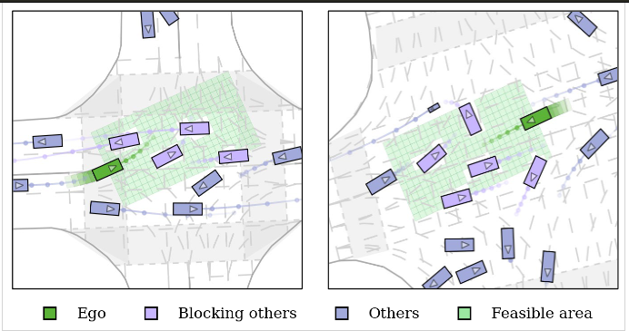
</div>

### Rule-violation cases

Rule-violation examples cover red-light entry, yellow-light entry, lane-direction violation, solid-line lane change, wrong-way candidates, and vulnerable-road-user encroachment.

<div align=center>

</div>

Representative labels are provided in `datasets/SinD_dataset/Semantic_labels/scenarios_sample.json`, and the browser preview in `semantic_preview/index.html` can load either the sample file or a full local `scenarios.json`. **Full labels can be accessed by applying for full dataset**.


### Scenario Testing Toolchain

The public toolchain turns an ordinary scene or semantic clip into a
reproducible test project with trajectory replay (Open-Loop Test), policy control (Closed-loop Test / Interactive Test), risk metrics,
logs, and interactive result visualization.

| Public policy | Role |
| --- | --- |
| `ground_truth` | Naturalistic trajectory replay |
| `risk_idm` | Risk-extended IDM baseline |
| `diffuser` | Diffusion baseline; model weights are provided after an approved application |

See the [testing toolchain guide](Simulation_test_toolchain/README.md) for
runnable templates and environment requirements.

### 3DGS Visual Simulation Extension

The 3DGS extension reconstructs signalized intersections, inserts auxiliary
traffic assets, and renders controlled ego-view sequences for vision-based
autonomous-driving evaluation.

<div align="center">
  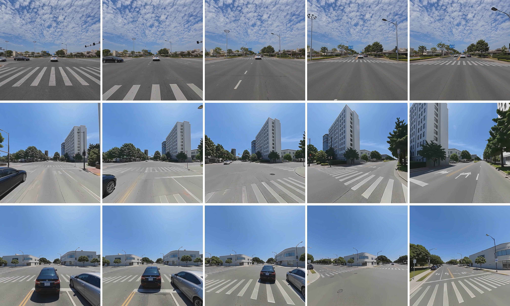
</div>

The extension is going to be prepared as an auxiliary release soon.

### SinD v2.0 Resources

| Resource | Link |
| --- | --- |
| Data layouts, conversion, and preprocessing | [DATASETS.md](DATASETS.md) |
| Semantic label schema and video preview | [semantic_preview/README.md](semantic_preview/README.md) |
| RiskIDM/Diffusion testing toolchain | [Simulation_test_toolchain/README.md](Simulation_test_toolchain/README.md) |
| Python dataset interface | [`src/trajdata/`](src/trajdata/) |

---

## 🕰️ SinD v1.0

SinD v1.0 is the original dataset presented at ITSC 2022. The repository keeps
its public sample records, CSV format specification, maps, and desktop
visualization tool for backward compatibility.

| Legacy resource | Link |
| --- | --- |
| Public sample records | [`Data/`](Data/) |
| Original CSV format | [Format.md](Format.md) |
| Original visualization tool | [`SIND-Vis-tool/`](SIND-Vis-tool/) |
| ITSC 2022 paper | [arXiv:2209.02297](https://arxiv.org/abs/2209.02297) |

---

## 📦 Quick Installation

```bash
conda create -n sind2 python=3.10
conda activate sind2
pip install -r requirements.txt
pip install -e .
```

Lanelet2 is optional but recommended for full map functionality. Detailed data
preparation instructions are provided in [DATASETS.md](DATASETS.md).

---

## 📥 Dataset Access

To request the full dataset, contact `li-yw23@mails.tsinghua.edu.cn`, `hong_wang@tsinghua.edu.cn`,
`13645450063@163.com`, or `18975505069@163.com` using an
educational email address.

Use the subject:

```text
[Apply for SinD] name_country(region)_organization
```

Please include your laboratory or department, research interests, and intended
use of the dataset. If you need the Diffuser model weights, explicitly state
this in your application.

---

## 📝 Citation

If you find the dataset or toolchain useful, please cite the corresponding
paper.

**[SinD v2.0 (arXiv:2607.16943)](https://arxiv.org/abs/2607.16943)**

```bibtex
@article{sindv2_2026,
  title={SinD 2.0: A Multi-City UAV Dataset with Semantic Risk Annotations for SOTIF-Oriented Safety Validation at Signalized Intersections},
  author={Li, Yunwei and Fu, Shengjie and Chen, Chunrong and Zhao, Chengxiang and Fan, Yuchen and Zhu, Mingyu and Xu, Yanchao and Zhang, Yuxin and Yang, Lan and Li, Chuzhao and Ji, Jie and He, Yi and Sarkar, Abhijit and Sonth, Akash and Wang, Hong and Li, Jun},
  journal={arXiv preprint arXiv:2607.16943},
  year={2026}
}
```

**SinD v1.0 (ITSC 2022)**

```bibtex
@INPROCEEDINGS{9921959,
  author={Xu, Yanchao and Shao, Wenbo and Li, Jun and Yang, Kai and Wang, Weida and Huang, Hua and Lv, Chen and Wang, Hong},
  booktitle={2022 IEEE 25th International Conference on Intelligent Transportation Systems (ITSC)},
  title={SIND: A Drone Dataset at Signalized Intersection in China},
  year={2022},
  pages={2471-2478},
  doi={10.1109/ITSC55140.2022.9921959}
}
```

If you use the `trajdata` interface, please also cite the `trajdata` paper where
appropriate.

---

## 🙏 Acknowledgements

The original visualization code builds on the public tooling of the
[inD dataset](https://github.com/ika-rwth-aachen/drone-dataset-tools) and the
[INTERACTION dataset](https://github.com/interaction-dataset/interaction-dataset).

<div align="center">
  
</div>

- School of Vehicle and Mobility, Tsinghua University
- Tsinghua Intelligent Vehicle Design and Safety Research Institute
- Safety Of The Intended Functionality (SOTIF) Research Team
